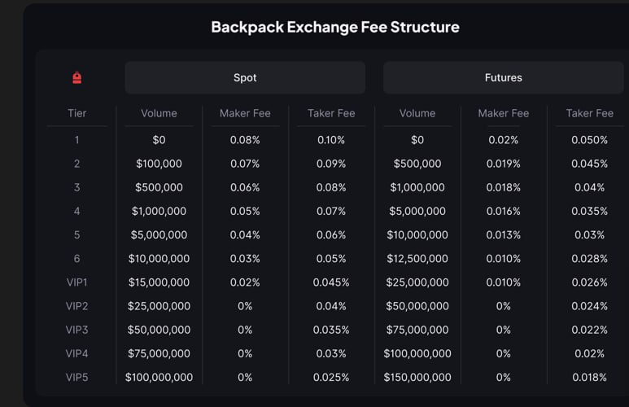

## backpackrust

一个使用 Rust 编写的 Backpack Exchange 示例交易机器人/客户端，用于backpack刷分：
- 该程序用于且仅用于Backpack刷分！本策略几乎不会有什么盈利，但也几乎不会有什么亏损！我也不相信散户个人量化能长期赚到钱！
- 逻辑非常简单：以当前卖一价格开空，等订单完成立刻以买一价格开多单，基本上都会成交。
- 量化开单挂单的速度远远超过人手挂单，而且对行情的反应也更快。手机上价格没变不代表实际价格没有波动，手机行情的延迟很高的。
- 合约的手续费远低于现货，建议刷合约，配合Solana Seeker手机1000U手续费返现，基本可以做到无损拿积分。

Backpack交易费率：


当前默认交易标的为 `SOL_USDC_PERP`，程序会：
1) 启动即将账户杠杆设置为 1.0（失败则退出）；
2) 订阅 `bookTicker.SOL_USDC_PERP` 与私有 `account.orderUpdate`；
3) 等到第一条行情后，以卖一价下「限价 PostOnly 空单」2 SOL；
4) 等该空单完全成交后，再以买一价下「限价 PostOnly 多单」2 SOL；
5) 打印关键日志并结束。

警告：该仓库仅用于学习与集成示例，请在测试环境或极小仓位下使用。策略逻辑非常基础，不构成任何投资建议。

## 目录结构

```
backpackrust/
	├─ Cargo.toml            # 依赖与编译配置（edition=2024）
	└─ src/
		 ├─ main.rs            # 程序入口：加载环境、初始化组件、并发启动 WS 和策略
		 ├─ auth.rs            # Ed25519 签名；生成 REST/WS 所需签名与头部
		 ├─ rest.rs            # REST 客户端：设置杠杆、下单
		 ├─ ws.rs              # WebSocket 客户端：订阅 bookTicker 与 account.orderUpdate
		 ├─ models.rs          # 数据结构与错误类型
		 └─ strategy.rs        # 简单示例策略：先开空再开多
```

## 安装与构建

请先安装Rust最新版

构建：

```bash
cargo build
```

运行：

```bash
cargo run
```

首次运行前请先准备 `.env`。

## 配置（.env）

项目使用以下环境变量（在根目录创建 `.env` 文件）：

```dotenv
# Base64 编码的公钥（交易所提供的 API Key）
BP_API_KEY=你的API_KEY_BASE64

# Base64 编码的 32 字节 Ed25519 私钥（交易所提供的 API Secret）
# 注意：必须是 32 字节原始私钥的 Base64 编码
BP_API_SECRET=你的API_SECRET_BASE64
```

请去交易所注册API：https://support.backpack.exchange/support-docs/cn/jiao-yi-suo-1/zhang-hu-gong-neng/sheng-cheng-backpack-jiao-yi-suo-api-mi-yao

## 修改数量

在strategy.rs文件中，这两行代码可以修改交易对和数量。如果纯粹从刷交易的角度，还是直接刷solana比较合适

const MARKET_SYMBOL: &str = "SOL_USDC_PERP";

const ORDER_QUANTITY: &str = "2.0"; // 2 SOL
